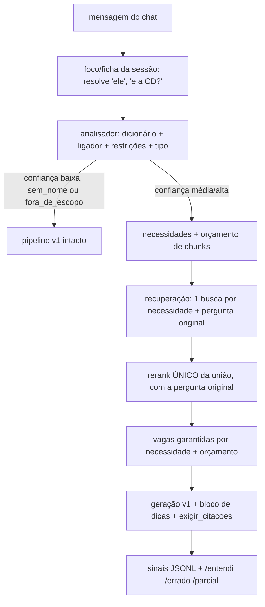

# Arquitetura v2 — analisador de pergunta em Python

Status: **proposta para aprovação (Ponto de Decisão 1)**. Nada aqui está implementado.
Números entre colchetes vêm da Fase 0 (`.superpowers/medicoes/*.json`); "não medido" quer dizer que ainda não há medição.

## 1. Ideia em uma frase
Antes de buscar, um código Python **sem LLM** lê a pergunta e diz o que ela pede: nomes do jogo, restrições, tipo e lista de necessidades. Essa leitura controla quantos documentos buscar e entra no prompt como lista de verificação. Se a leitura tiver pouca confiança, a v2 se comporta exatamente como a v1.

## 2. Fluxo

## 3. Componentes (pacote novo `rag_v2/`; a v1 não muda)

| Módulo | Entrada → saída |
|---|---|
| `dicionario.py` | registros do corpus + `conhecimento/apelidos.yaml` → índice `nome_normalizado → [Chave(Tabela, Nome, Fonte, sub=None)]`, em cache por processo |
| `ligador.py` | texto + índice → `[Ligacao(trecho, chave, score, tipo: exata/aproximada/apelido, alternativas)]` |
| `restricoes.py` | texto + ligações → `{nivel, classe, raca, pericias, itens}` |
| `tipo.py` | ligações + texto → `direta / multiparte / build / sem_nome / fora_de_escopo` |
| `necessidades.py` | ligações + restrições + tipo → `[Necessidade(descricao, tabela_alvo, entidade, obrigatoria)]` |
| `orcamento.py` | leitura → `k` (mín., máx. ou fallback 12) |
| `foco.py` | mensagem + sessão → mensagem resolvida ou "ambíguo" (cai na reformulação v1) |
| `leitura.py` | junta tudo em `Leitura` (dataclass), com `confianca` e `motivos` |
| `conhecimento.py`, `sinais.py` | YAML de apelidos e propostas; JSONL de sinais |

**Dicionário.** Os nomes vêm dos mesmos registros da ingestão. A normalização usa minúsculas, tira acentos (a mesma `rag_core.normalizar`) e trata o plural simples. Ele indexa também os **subnomes**: habilidades aninhadas no registro, como "Fúria" dentro de Classes > Bárbaro e "Chifres" dentro de Raças > Minotauro. Cada subnome aponta para o registro pai, porque o mapa mostrou que eles não têm registro próprio. A tabela "Regreiro (Perguntas e Respostas)" fica fora do dicionário, porque nela o "Nome" é a pergunta inteira.

**Ligador.** Percorre janelas de 1 a 5 palavras da pergunta normalizada, da maior para a menor, e tenta nesta ordem:
1. nome exato;
2. apelido aprovado;
3. nome aproximado com `difflib.SequenceMatcher`, da biblioteca padrão, sem dependência nova.

Cada palavra da pergunta só pode ser ligada uma vez. Para palavras soltas que também são português comum ("cura", "grande", "ácido"), a ligação aproximada fica proibida, e a exata só vale com uma palavra de pista da tabela por perto ("magia", "condição", "perícia"). Medido no caso semente: "machado toureo" contra "Machado Táurico" dá **0,828**, "bugber" contra "bugbear" dá 0,923 e "machado taurino" dá 0,933. O limiar inicial proposto é **0,80** para nomes de 2+ palavras e **0,90** para nomes de 1 palavra com 6+ letras, a calibrar na Fase 3 com o conjunto rotulado. Avaliar `rapidfuzz` só se o `difflib` for lento ou impreciso na medição.

**Restrições.** Padrões fixos: nível (`nv4`, `nível 4`, `lvl 4`, `4º nível`); classe, raça, perícia e item vêm das ligações cuja Tabela é Classes, Raças, Perícias, Armas, etc.

**Tipo.** As regras usam sinais contáveis:
- `sem_nome`: nenhuma ligação;
- `fora_de_escopo`: sem ligação e sem vocabulário do jogo (lista curta: "teste", "PM", "dano"...);
- `build`: classe ou raça + nível ou palavras como "combam", "build", "melhor";
- `multiparte`: 2+ interrogações, conectivo "e qual/quais" ou 2+ tabelas distintas;
- `direta`: o resto.

**Necessidades** (usam só campos que o `docs/MAPA_CORPUS.md` confirma):

| Entidade | Necessidade gerada |
|---|---|
| Classe (+nível N) | registro da classe; habilidades até N (campo `levelProgression`, 100%); poderes da classe (tabela "Poderes (Classe)") |
| Raça | registro da raça (campos `abilities` e `attributeModifiers`, 100%). Raças **não** têm campo de tamanho: o tamanho fica no texto das habilidades |
| Arma | registro da arma (`damage`, `critical`, `grip`, `proficiency`) |
| Perícia | registro da perícia |
| Magia, condição, poder, item | registro da entidade |
| Build | as acima + "poderes gerais que citam a perícia ou arma" (busca, não campo) |

## 4. Nomes em várias tabelas ou fontes
Dados do mapa: **160** nomes se repetem. **155** deles se repetem entre *tabelas diferentes* (ex.: "Abençoado" é condição e encantamento de armadura), e só **5** na mesma tabela com fontes diferentes (ex.: "Avatar de Aharadak" em Ameaças de Arton e em Deuses de Arton). Também existem grafias diferentes da mesma fonte: "Tormenta20 - Jogo do Ano", em 3 grafias, e "Guia de/dos Deuses Menores".

A política proposta:
1. Uma palavra de pista da tabela na pergunta decide ("condição abençoado").
2. Uma restrição já ligada também decide: "poder de bárbaro" puxa Poderes (Bárbaro).
3. Se nada decide, a v2 traz **todos** os registros, com vaga para cada um, e grava a ambiguidade como sinal.
4. Mesma tabela com várias fontes: vale a ordem de prioridade abaixo. A ordem é sua decisão.

Ordem proposta, por número de registros e por ser livro base:
1. Tormenta20 - Jogo do Ano (todas as grafias);
2. Herois de Arton;
3. Ameaças de Arton;
4. Deuses de Arton;
5. Compendio T20 (atenção: é também o rótulo padrão de quem não tem fonte, em `rag_core._fonte_do_registro`);
6. Guia de/dos Deuses Menores;
7. as demais (Dragão Brasil/DB e outros).

`/entendi` mostra o registro escolhido e as alternativas.

## 5. Reformulação e tradução por LLM da v1 (você decide)

| Opção | O que faz | Tempo medido | Risco |
|---|---|---|---|
| **A** | mantém as duas chamadas e só acrescenta a leitura | tradução: média [3,9 s], máx. [24,2 s]; reformulação: [0,6–8,1 s]; 0 falhas em 10 + 5 | a tradução **mutilou** a pergunta semente ("Machado Touro", "Barbário", sem Bugbear nem nível) |
| **B** | troca a reformulação pela resolução de foco em Python; mantém a tradução | economiza a reformulação quando o foco resolve | foco errado; cai na v1 quando há ambiguidade |
| **C** | com confiança alta, pula as duas; com baixa, mantém ambas como fallback | economiza ~4 s em média | pular a tradução pode perder sinônimos que ela traz |

Efeito na cobertura: **não medido** (será medido na Fase 2).
**Recomendação: C**, porque o caso semente mostra a tradução apagando justamente os nomes que o ligador acha. Se preferir ir aos poucos, A é o padrão conservador.

## 6. Orçamento de chunks e de latência
- **Chunks** (valores iniciais conservadores):
  - `direta`: k = 8;
  - `multiparte`: 4 por necessidade, de 8 a 15;
  - `build`: 15;
  - confiança baixa: **12**, como na v1.

  A calibração vem na Fase 5.1 pelos percentis 50/90/100 do k necessário nos contextos gravados (**não medido**). Um corte por queda de score só depois de existir um reranker multilíngue.
- **Latência**: hoje a recuperação leva média [11,4 s] e máximo [28,3 s], e o FlashRank sozinho responde por [11,0 s] (97%). O resto (embedding, Qdrant e BM25) soma ~[0,4 s].
  - Orçamento proposto: analisador < 50 ms; recuperação da v2 ≤ média da v1.
  - Por isso a v2 faz **um único rerank** da união dos candidatos, nunca um por necessidade.
  - A vaga de cada necessidade sai do rótulo de origem do candidato, sem rerank extra.
  - Acelerações candidatas, a medir:
    1. limitar os candidatos antes do rerank (hoje vão **todos**: `compressor.top_n = len(docs)` em `recuperar`);
    2. revisar o limite de **2 threads** do ONNX imposto ao FlashRank (`rag_core.py:60`), que é proposital e serve para não travar a máquina;
    3. truncar o texto dos candidatos.

## 7. Recuperação e prompt
- Uma busca (ensemble atual) por necessidade, mais a pergunta original. Rerank com a pergunta **original**, porque a combinada derrubou o FlashRank em inglês (docstring de `rag_core.recuperar`). Uma alternativa só entra se for medida.
- Vagas garantidas: o melhor candidato de cada necessidade obrigatória entra no top-k antes do preenchimento por score (estende a ideia de `_diversificar(cota_tabelas)`).
- Bloco de dicas **depois** do contexto, sem tocar o `SYSTEM_PROMPT`: "A pergunta pede: 1) ...; 2) .... Para cada item, responda com citação ou diga que a base não cobre." `exigir_citacoes` (teto 3) e `estado_citacao` continuam iguais.

## 8. Sessão, aprendizado e comandos
- **Ficha** (classe, raça, nível, itens) e **foco** (última entidade) ficam num objeto de sessão ao lado do `chat_history`. Ambos são zerados em `/novo` e anexados ao relato de `salvar_sessao_campanha` sem mudar o formato dela.
- **Aprendizado** (só interpretação, nunca regra):
  - `conhecimento/propostas.yaml` guarda as entradas pendentes;
  - `conhecimento/apelidos.yaml` guarda só as aprovadas, cada apelido apontando para a chave completa (Tabela + Nome + Fonte);
  - `conhecimento/APRENDIZADOS.md` é gerado do YAML, nunca editado à mão.
  - `tools/conhecimento.py aprovar` checa se o registro existe, se há colisão com nome real ou outro apelido e se o formato está certo; depois oferece rodar o teste fechado. `verificar` suspende (não apaga) apelidos órfãos após reingestão.
- **Sinais**: JSONL local, fora do git, sem chaves.
- **Comandos**: `/entendi`, `/ficha [campo=valor]`, `/errado`, `/parcial`.

## 9. Plugue na v1 (depois que a T3 encerrar)
`ARQUITETURA=v2` (padrão `v1`). Edições mínimas: `index.processar` chama `rag_v2.leitura.ler()` e desvia; `avaliar.py` ganha só a flag. Todo o resto fica em arquivos novos. O `pyyaml` é declarado no `pyproject.toml` na Fase 3.

## 10. Riscos e parâmetros a calibrar
- **Riscos**:
  - falso positivo de nome comum ("cura", "grande");
  - empates no ligador;
  - foco herdado errado;
  - FlashRank em inglês continuar derrubando alvos (caso 53);
  - embedding `multilingual-e5-base` usado **sem** os prefixos `query:`/`passage:` que o modelo espera. Corrigir exige reindexar, e isso é decisão sua.
- **A calibrar**: limiares do ligador (0,80/0,90), k por tipo, regra de confiança, lista de palavras-pista por tabela.
- **Plano de avaliação** (Fase 2): suíte de 12 (8 dev + 4 de teste fechado), perguntas sintéticas sem LLM, conjunto rotulado de 20 a 30 perguntas para o analisador, linha de base v1. As 68 antigas ficam como alarme só-recuperação.
