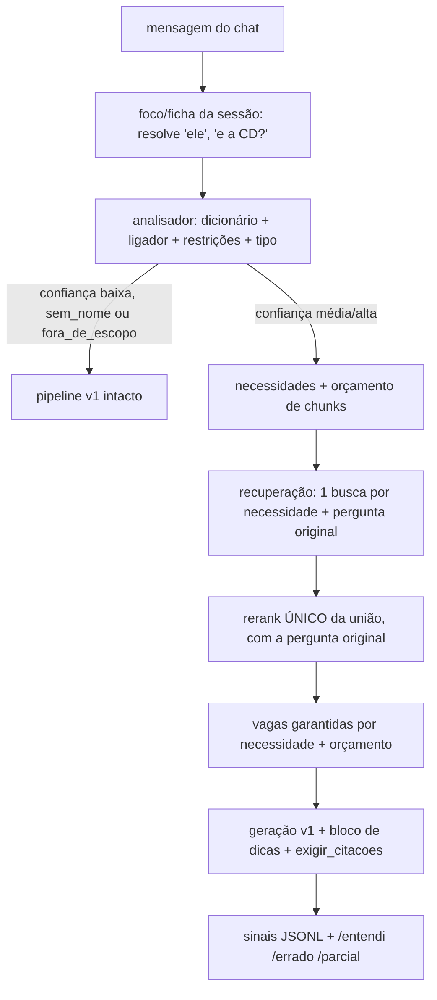

# Arquitetura v2 — analisador de pergunta em Python

Status: **desenho aprovado no Ponto 1** (limiares, ordem de fontes e opção C fixados). Implementado e plugado atrás de `ARQUITETURA=v2` (padrão `v1`):
- analisador (`rag_v2/`);
- recuperação por necessidade;
- lista de verificação ao LLM;
- ficha/foco da sessão;
- apelidos aprovados (`tools/conhecimento.py`);
- sinais (`SINAIS=1`);
- comandos `/entendi`, `/ficha`, `/errado` e `/parcial`.

Fase 2 feita: suíte de 12 + sequências, avaliador absoluto com rastreio por etapa (`tools/avaliar_v2.py`), perguntas sintéticas sem LLM (`tools/gerar_sinteticas.py`) e conjunto rotulado provisório do analisador (`tools/medir_analisador.py`). Aguarda a correção do usuário nos `fatos_esperados` e nos rótulos.

Ainda não foi feito: gerador de propostas a partir dos sinais e leitura de feedback em linguagem natural (Fase 6).
Números entre colchetes vêm da Fase 0 (`.superpowers/medicoes/*.json`). "Não medido" quer dizer que ainda não há medição.

## 1. Ideia em uma frase
Antes de buscar, um código Python **sem LLM** lê a pergunta e diz o que ela pede: nomes do jogo, restrições, tipo e lista de necessidades. Essa leitura controla quantos documentos buscar e entra no prompt como lista de verificação. Com pouca confiança, a v2 se comporta exatamente como a v1.

## 2. Fluxo

## 3. Contratos (pacote `rag_v2/`; a v1 não muda)
Dataclasses congeladas, sem lógica:

| Tipo | Campos |
|---|---|
| `Chave` | `tabela, nome, fonte, sub` (`sub` = habilidade aninhada, ex. "Fúria" dentro de Classes > Bárbaro) |
| `Ligacao` | `trecho, inicio, fim, chave, score, tipo` (`exata`/`aproximada`/`apelido`), `alternativas` |
| `Restricoes` | `nivel, classes, racas, pericias, itens` |
| `Necessidade` | `descricao, tabela_alvo, entidade, obrigatoria` |
| `Leitura` | `texto_original, ligacoes, restricoes, tipo, necessidades, k, confianca, motivos, usar_llm` |

| Módulo | Entrada → saída |
|---|---|
| `dicionario` | registros do corpus + apelidos aprovados → `nome_normalizado → [Chave]` |
| `ligador` | texto + dicionário → `[Ligacao]` |
| `restricoes` | texto + ligações → `Restricoes` |
| `tipo` | ligações + texto → `direta/multiparte/build/sem_nome/fora_de_escopo` |
| `necessidades` | ligações + restrições + tipo → `[Necessidade]` |
| `orcamento` | tipo + necessidades + confiança → `k` |
| `leitura` | texto + dicionário → `Leitura` (junta tudo) |

## 4. Dicionário e ligador
**Dicionário.** Nomes dos mesmos registros da ingestão, normalizados por `rag_core.normalizar` (minúsculas, sem acento) com plural simples. Também indexa os **subnomes** (habilidades dentro de Classes e Raças), que apontam para o registro pai, porque o mapa mostrou que eles não têm registro próprio. A tabela "Regreiro (Perguntas e Respostas)" fica de fora: nela o "Nome" é a pergunta inteira.

**Ligador.** Percorre janelas de 5 a 1 palavras, da maior para a menor, e cada palavra só é ligada uma vez. Para cada janela tenta, nesta ordem: nome exato, apelido aprovado, nome aproximado.
- A semelhança vem do `difflib.SequenceMatcher`, da biblioteca padrão (sem dependência nova).
- **Limiares fixados:** 0,80 para nomes de 2+ palavras e 0,90 para nomes de 1 palavra com 6+ letras.
- Palavras comuns do português ("cura", "grande", "ácido"...) só ligam por nome exato e com uma pista da tabela por perto ("magia", "condição", "perícia").
- Palavras de categoria ("magia", "condição", "habilidades", "parceiro"...) são **pista, nunca nome**, quando aparecem sozinhas. No corpus real elas também são nomes: Arcanista > Magias, Regras > Habilidades, Magias > Condição.
- A ligação aproximada não atravessa pontuação nem usa palavra comum: no corpus real, "dano, a área" ficou parecido com "Dança da Areia" (0,80).
- Tabelas de categoria ("Categorias de Poder", "Categorias de Equipamento") perdem o empate para a entidade: "bárbaro" é a classe, não a categoria.
- Medido no caso semente: "machado toureo" contra "Machado Táurico" dá 0,828; "bugber" contra "bugbear" dá 0,923; "machado taurino" dá 0,933.

**Empates e nomes repetidos** (160 nomes se repetem no corpus: 155 entre tabelas diferentes, 5 na mesma tabela com fontes diferentes). A política decide nesta ordem e para no primeiro critério que desempata:
1. pista de tabela na pergunta ("condição abençoado");
2. restrição já ligada ("poder de bárbaro" puxa Poderes (Bárbaro));
3. prioridade de fonte, abaixo;
4. se nada desempata, traz **todos**, com vaga para cada um, e grava a ambiguidade como sinal.

**Ordem de fontes (fixada).** As grafias são normalizadas antes de comparar ("Tormenta20 - Jogo do Ano" aparece em 3 formas; "Guia de/dos Deuses Menores"; "DB - n" e "Dragão Brasil - n"):
1. Tormenta20 - Jogo do Ano;
2. Herois de Arton;
3. Ameaças de Arton;
4. Deuses de Arton;
5. Compendio T20 (atenção: é também o rótulo padrão de quem não tem fonte, em `rag_core._fonte_do_registro`);
6. Guia de/dos Deuses Menores;
7. as demais.

## 5. Restrições, tipo, necessidades, orçamento
- **Restrições:** nível por padrões (`nv4`, `nível 4`, `lvl 4`, `4º nível`); classe, raça, perícia e item vêm das ligações cuja Tabela é Classes, Raças, Perícias, Armas etc.
- **Tipo**, por sinais contáveis:
  - `sem_nome`: nenhuma ligação;
  - `fora_de_escopo`: sem ligação e sem vocabulário do jogo;
  - `build`: classe ou raça + nível, ou palavras como "combam", "build", "melhor";
  - `multiparte`: 2+ interrogações, conectivo "e qual/quais" ou 2+ tabelas distintas;
  - `direta`: o resto.
- **Necessidades** (só campos que o `docs/MAPA_CORPUS.md` confirma):

| Entidade | Necessidade gerada |
|---|---|
| Classe (+nível N) | registro da classe; habilidades até N (`levelProgression`, 100%); poderes da classe (tabela "Poderes (Classe)") |
| Raça | registro da raça (`abilities` e `attributeModifiers`, 100%). Raças **não** têm campo de tamanho |
| Arma | registro da arma (`damage`, `critical`, `grip`, `proficiency`) |
| Perícia, magia, condição, poder, item | registro da entidade |

- **Orçamento de chunks** (valores iniciais, constantes nomeadas, a calibrar): `direta` 8; `multiparte` 4 por necessidade, de 8 a 15; `build` 15; confiança baixa 12, como na v1.

## 6. Confiança e uso do LLM (opção C, fixada)
Regra determinística (`rag_v2/leitura.py`):
- **alta:** todas as ligações exatas ou por apelido e nenhum empate sem desempate;
- **média:** alguma aproximada abaixo de 0,85, só ligações aproximadas, ou empate sem desempate. No empate, a política traz **todas** as alternativas como necessidades, cada uma com vaga, em vez de descartar a leitura;
- **baixa:** `sem_nome`, `fora_de_escopo`, ou trecho ligado só por palavra comum.

| Confiança | Reformulação e tradução por LLM |
|---|---|
| alta | puladas |
| média | só a tradução |
| baixa | v1 completa (fallback total) |

Motivo: a tradução apagou os nomes da pergunta semente ("Machado Touro", "Barbário", sem nível) [tradução: média 3,9 s, máx. 24,2 s].

## 7. Recuperação, prompt e latência
- Uma busca (ensemble atual) por necessidade, mais a pergunta original. **Um único rerank** da união, com a pergunta **original**, porque a combinada derrubou o FlashRank em inglês (docstring de `rag_core.recuperar`).
- Vagas garantidas: o melhor candidato de cada necessidade obrigatória entra antes do preenchimento por score (estende `_diversificar(cota_tabelas)`).
- Bloco de dicas **depois** do contexto, sem tocar o `SYSTEM_PROMPT`: "A pergunta pede: 1) ...; 2) .... Para cada item, responda com citação ou diga que a base não cobre." `exigir_citacoes` (teto 3) e `estado_citacao` ficam iguais.
- Latência: a recuperação leva [11,4 s] em média e [28,3 s] no máximo, dos quais [11,0 s] são do FlashRank. A v2 mediu ~7 s por pergunta nas suítes de avaliação (um só rerank). Analisador medido em 24 perguntas rotuladas: média 9 ms, máximo 24 ms; numa frase longa sem nomes chegou a 75 ms (acima da meta de 50 ms, desprezível ao lado do rerank). O dicionário carrega em ~1,1 s. Acelerações candidatas, a medir: limitar os candidatos antes do rerank (hoje vão todos, `compressor.top_n = len(docs)`), revisar o limite de 2 threads do ONNX (`rag_core.py:60`), truncar o texto dos candidatos.

## 8. Sessão, aprendizado e comandos
- **Ficha** (classe, raça, nível, itens) e **foco** (última entidade) ficam num objeto de sessão ao lado do `chat_history`, zerados em `/novo` e anexados ao relato de `salvar_sessao_campanha` sem mudar o formato dela.
- **Aprendizado** (só interpretação, nunca regra): `conhecimento/propostas.yaml` guarda as pendentes; `conhecimento/apelidos.yaml` guarda só as aprovadas, cada apelido apontando para a chave completa; `conhecimento/APRENDIZADOS.md` é gerado do YAML. `tools/conhecimento.py aprovar` valida (registro existe, sem colisão, formato) e oferece rodar o teste fechado; `verificar` suspende apelidos órfãos após reingestão.
- **Sinais:** JSONL local, fora do git, sem chaves. **Comandos:** `/entendi`, `/ficha [campo=valor]`, `/errado`, `/parcial`.
- **Plugue (feito):** `ARQUITETURA=v2` (padrão `v1`).
  - No chat (`index.processar`), a leitura usa a sessão. Com confiança baixa ou `/filtro` ativo, a v1 roda inteira.
  - No avaliador, `ARQUITETURA=v2 make avaliar` grava `registro["v2"]` com a leitura e a telemetria da recuperação.
  - Com a flag desligada, nada da v2 é montado.
  - `pyyaml` e o pacote `rag_v2` estão declarados no `pyproject.toml`.
- **Referências e ficha:** "e a CD dela?" sem nome herda o **foco** (ligação do tipo `foco`, confiança média). Uma pergunta em primeira pessoa ("combina comigo?") herda a **ficha**. Uma referência sem foco cai na reformulação da v1.

## 9. Avaliação: v2 em termos absolutos, sem v1 ao lado
A v1 foi ajustada olhando as perguntas fixas, então compará-la com a v2 seria enviesado. Não há linha de base v1 nem tabela v1 × v2. A v2 é avaliada por:
1. **teste fechado** (4 das 12 perguntas), rodado só ao fim de cada marco e nunca usado para ajustar;
2. **dev** (8 das 12) para iterar;
3. **perguntas sintéticas novas a cada rodada**, com semente registrada;
4. **sinais do uso real** (`/errado`, `/parcial`, "não há", `sem_citacao`) e a fila de falhas;
5. **acerto do analisador** num conjunto de 20 a 30 perguntas rotuladas à mão.

As 68 perguntas antigas servem só de **alarme de fumaça** (recuperação, sem nota). A adoção da v2 se baseia em números absolutos por nível de dificuldade (cobertura por necessidade e por entidade, `fatos_esperados`, `sem_citacao`/`citacoes_fora`/`citacoes_ok`, chunks, caracteres, tempo) e na fila de falhas, com critérios de aceite fixados antes de rodar. A comparação de rerankers compara variantes **da v2** entre si, no dev.

## 10. Riscos e parâmetros a calibrar
- **Riscos:** falso positivo de nome comum; empates no ligador; foco herdado errado; FlashRank em inglês derrubando alvos (caso 53); embedding `multilingual-e5-base` usado **sem** os prefixos `query:`/`passage:` que o modelo espera. Implementado atrás de `EMBEDDING_PREFIXOS=e5` (coleção paralela `tormenta20_e5p`, padrão desligado). **Medido: sem ganho relevante.** Na busca densa pura (top-50) de 76 entidades esperadas, o MRR foi 0,700 sem prefixo e 0,711 com (melhor em 12, pior em 10); a cobertura da v2 ficou idêntica nas duas variantes (dev e semente 9). Recomendação: manter desligado e não adotar a coleção nova como padrão. A busca densa sozinha acha só 69% das entidades do dev no top-50, o que confirma que o registro direto por nome é o que sustenta a v2.
- **Achados da avaliação (já corrigidos como classes de falha):** registros minúsculos fundidos no chunk do vizinho (62 de 4.466; a busca direta não os via); pronome entrando em nome; "erro de digitação" que é palavra real do corpus; aproximação sem âncora (pista de categoria + palavra curta); `subAbilities` do Arcanista (Feiticeiro, Bruxo, Mago) fora do dicionário.
- **A calibrar:** limiares do ligador (0,80/0,90, valores iniciais), k por tipo, regra de confiança, lista de palavras-pista por tabela.
